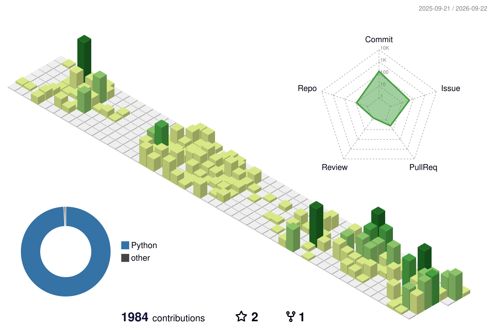

## Jilles Moraes Cardoso

Staff Engineer at [@madeiramadeirabr](https://github.com/madeiramadeirabr). I build the platform and
the measurement layer the rest of engineering runs on.

- **Developer productivity** — DORA and flow metrics pulled from Jira and Git, collected and served
  as a product instead of a quarterly spreadsheet.
- **Platform engineering** — containerized collectors and services on AWS/ECS, CI/CD, and the paved
  road other teams ship on.
- **Observability and quality** — Grafana, Prometheus/Loki, SonarQube: making regressions visible
  before they become an incident.
- **Agentic tooling** — Claude Code skills, MCP servers and agent orchestration, pointed at real
  engineering workflows rather than demos.

Most of my work lives in private repositories. The contribution graph below is the shape of it —
the content stays where it belongs.

## Open source

<!-- oss starts -->
- `2026-09-10` **[compozy/compozy](https://github.com/compozy/compozy)** — [Skills catalog is sent twice on every session's first turn, and input-only daemon sessions rec…](https://github.com/compozy/compozy/issues/604) issue, closed
- `2026-09-10` **[compozy/compozy](https://github.com/compozy/compozy)** — [memory health reports Dream Enabled: true when the dream role is disabled](https://github.com/compozy/compozy/issues/603) issue, closed
- `2026-09-09` **[compozy/compozy](https://github.com/compozy/compozy)** — [Previous-version sessions in the store make an idle daemon log the same warning ~12x/min per s…](https://github.com/compozy/compozy/issues/566) issue, closed
- `2026-07-29` **[kcchien/claude-code-statusline](https://github.com/kcchien/claude-code-statusline)** — [Fix status line going blank on Linux, branch glyph overlap, and cache scoping](https://github.com/kcchien/claude-code-statusline/pull/9) PR, open
- `2025-03-11` **[openvinotoolkit/sd-webui-openvino](https://github.com/openvinotoolkit/sd-webui-openvino)** — [Questions About sd-webui-openvino Extension Compatibility and Usage](https://github.com/openvinotoolkit/sd-webui-openvino/issues/7) issue, open
- `2025-03-06` **[RVR06/cornifer](https://github.com/RVR06/cornifer)** — [TypeError: Cannot read properties of undefined (reading 'join')](https://github.com/RVR06/cornifer/issues/13) issue, closed
- `2024-11-04` **[structurizr/onpremises](https://github.com/structurizr/onpremises)** — [Saml authentication stopped to work in version v2024-11-04](https://github.com/structurizr/onpremises/issues/138) issue, closed
- `2023-10-05` **[drodil/backstage-plugin-toolbox](https://github.com/drodil/backstage-plugin-toolbox)** — [backstage version bump is not possible - createCardExtension should be imported from @backstag…](https://github.com/drodil/backstage-plugin-toolbox/issues/55) issue, closed
<!-- oss ends -->

## Contributions

<picture>
  <source media="(prefers-color-scheme: dark)" srcset="profile-3d-contrib/profile-night-view.svg" />
  <source media="(prefers-color-scheme: light)" srcset="profile-3d-contrib/profile-green-animate.svg" />
  
</picture>

---

[LinkedIn](https://www.linkedin.com/in/jillesmc)
