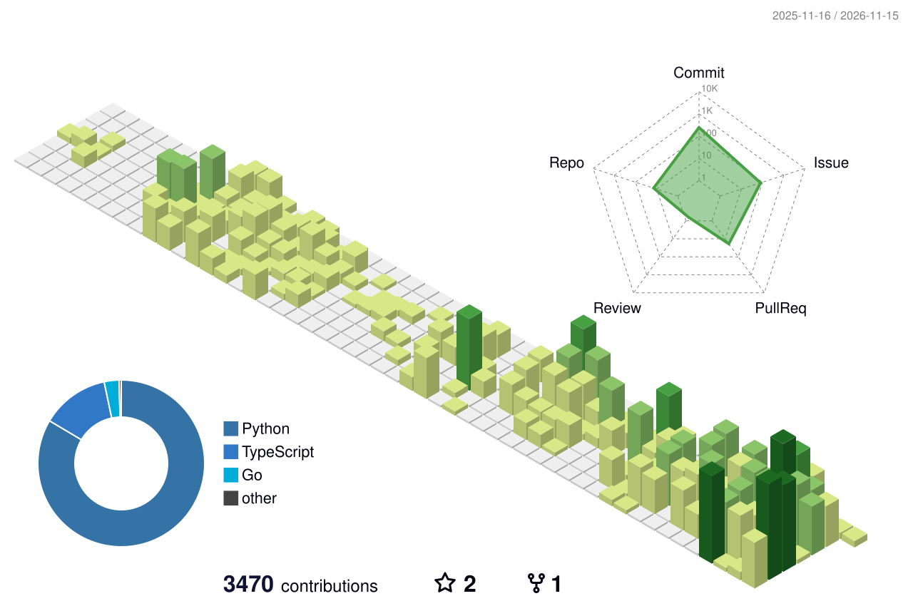

## Jilles Moraes Cardoso

Staff Engineer at [@madeiramadeirabr](https://github.com/madeiramadeirabr). I build the platform and
the measurement layer the rest of engineering runs on.

- **Developer productivity** — DORA and flow metrics pulled from Jira and Git, collected and served
  as a product instead of a quarterly spreadsheet.
- **Platform engineering** — containerized collectors and services on AWS/ECS, CI/CD, and the paved
  road other teams ship on.
- **Observability and quality** — Grafana, Prometheus/Loki, SonarQube: making regressions visible
  before they become an incident.
- **Agentic tooling** — Claude Code skills, MCP servers and agent orchestration, pointed at real
  engineering workflows rather than demos.

Most of my work lives in private repositories. The contribution graph below is the shape of it —
the content stays where it belongs.

## Open source

<!-- oss starts -->
- `2026-11-21` **[compozy/compozy](https://github.com/compozy/compozy)** — [Allow fallback_chain in [agents.overrides.<agent>] for packaged agents](https://github.com/compozy/compozy/issues/1928) issue, open
- `2026-11-21` **[compozy/compozy](https://github.com/compozy/compozy)** — [Notification clicks reuse an existing Session window instead of opening a tab per session](https://github.com/compozy/compozy/issues/1927) issue, open
- `2026-11-21` **[compozy/compozy](https://github.com/compozy/compozy)** — [Put running-activity indicators in the leading column for every sidebar row type](https://github.com/compozy/compozy/issues/1926) issue, open
- `2026-07-29` **[kcchien/claude-code-statusline](https://github.com/kcchien/claude-code-statusline)** — [Fix status line going blank on Linux, branch glyph overlap, and cache scoping](https://github.com/kcchien/claude-code-statusline/pull/9) PR, open
<!-- oss ends -->

## Contributions

<picture>
  <source media="(prefers-color-scheme: dark)" srcset="profile-3d-contrib/profile-night-view.svg" />
  <source media="(prefers-color-scheme: light)" srcset="profile-3d-contrib/profile-green-animate.svg" />
  
</picture>

---

[LinkedIn](https://www.linkedin.com/in/jillesmc)
